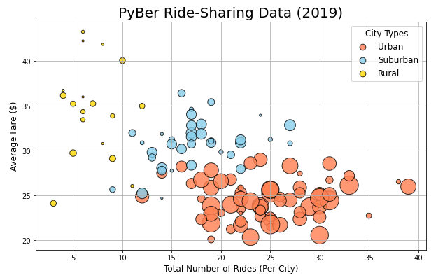
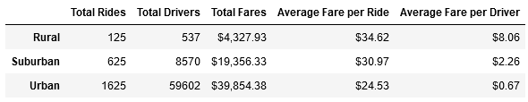

# PyBer Ride-Share Analysis
## Overview of Project 
V. Isualize has tasked us with analyzing PyBer ride-share data to provide insight for the decision-makers of the company to use in future planning. 
## Results
We began the project by organizing our data set by city type:
  * Urban
  * Suburban
  * Rural

Once we sorted our data by type, we were able to perform several analyses in order to show the differences in how PyBer operates in each type of city:

  * We graphed a distribution of the total number of rides per city by the average fares of those rides, with markers that indicate the driver count for each of the cities, colored by the city type. As presented in the graph and DataFrame below, the type of city directly correlates to the number of drivers per city, with suburban cities having nearly double the driver count of rural cities, and urban cities having nearly double the suburban count. Furthermore, as the number of drivers increase with city type, the average fare per ride decreases. 
  
  
  
  * Following the city type summary analysis, we were able to take a closer look at the total amount of fares collected for each type. According to the graph below, urban cities have a much higher fare total in the spring of 2019 compared to suburban and rural cities. 
  
  
## Conclusion 
Based on our analysis of the Pyber ride-share data, we can make a few recommendations for the future business model of the company:
  
  1. Urban cities have a significantly higher driver count, possibly leading to an increase in personnel issues. Special attention should be given to the successful managing of a larger and more diverse driver group.
  2. Rural cities have a higher average fare charged, possibly from longer rides taken. PyBer should invest in roadside assistance for rural drivers as increasing the distances driven will increase the likelihood of accidents and general car troubles.
  3. Urban and Suburban cities have higher fare collection rates and should be given more resources to successful complete rides with high satisfaction rates from PyBer users. 
